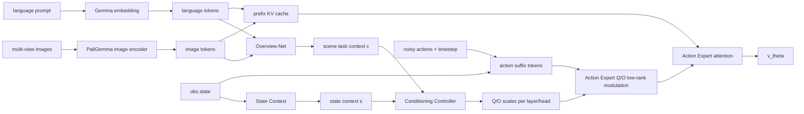

# OverLoCK 与 π0 融合新方案：Overview-Conditioned Action Expert

## 1. 方案定位

这份方案综合三件事：

1. PDF 中的核心规划：用 `Overview-Net` 生成 `context prior`，再让局部 token 与全局 prior 建立关系，调制 action expert。
2. 当前 openpi 代码结构：`embed_prefix()` 只处理图像和语言，`embed_suffix()` 处理 state/action，`sample_actions()` 只缓存 image/language prefix。
3. 更强的创新诉求：避免退化成普通 image-token heatmap gate，把创新点放到 Action Expert 如何读取视觉-语言 prefix。

最终建议的主方法命名为：

```text
Overview-Conditioned Action Expert (OCAE)
```

核心一句话：

```text
不直接改视觉 backbone，也不只给图像 token 加 gate，
而是用 overview context 动态校准 action expert 的 attention 读取方式。
```

## 2. 直观解释

普通 top-down gating 问的是：

```text
这张图哪里重要？
```

OCAE 问的是：

```text
面对当前语言指令、场景和机器人状态，action expert 应该怎样读取同一组视觉-语言 token？
```

例如同一张桌面图像中有按钮、杯子、碗和机械臂：

1. 指令是 `press the button`，动作 token 应该更关注按钮、末端执行器、接触方向。
2. 指令是 `pick up the cup`，动作 token 应该更关注杯子、夹爪姿态、可抓取边缘。
3. 指令是 `put the cup into the bowl`，动作 token 应该更关注杯子与碗之间的空间关系。

视觉-语言 prefix 可以不变，但 action token 对它的查询方式应该改变。这就是把 OverLoCK 的：

```text
overview first -> look closely next
```

迁移成 π0 中的：

```text
overview first -> condition action expert reading -> predict action
```

## 3. 与 PDF 方案的关系

PDF 方案的主线是合理的：

```text
[V, L] -> C_t
[A_t^tau, C_t] -> local-global relation
z_i' = z_i + gate_i * Adapter(z_i)
```

它强调三点：

1. `C_t` 不应退化成目标区域 mask。
2. 局部 token 与 context prior 的关系才是核心。
3. 第一版不应完整动态生成 QKV 权重。

本方案保留这些思想，但对落地路径做一个关键调整：

```text
PDF 首版: 把 C_t 作为新 token 插入 [V, L, C, q, A]
本文首版: C_t 先不插 token 序列，而是作为 action expert conditioning 信号
```

原因是当前 openpi 的 prefix cache 和 expert routing 尚未为 `[V, L, C, q]` 缓存结构准备好。先做 conditioning 版本，能保留创新点，同时减少对 token 序列、mask、cache 的侵入。

## 4. 当前仓库代码事实

### 4.1 `Pi0.embed_prefix()`

当前 `src/openpi/models/pi0.py` 中，prefix 只包含图像和语言：

```text
obs.images[name] -> self.PaliGemma.img(...) -> image_tokens
obs.tokenized_prompt -> self.PaliGemma.llm(..., method="embed") -> language tokens
```

返回：

```text
tokens, input_mask, ar_mask
```

这些 tokens 在采样时用于构造 prefix KV cache。

### 4.2 `Pi0.embed_suffix()`

当前 suffix 包含：

```text
pi0: state token + noisy action tokens
pi0.5: noisy action tokens, timestep 通过 adaRMS 注入
```

这意味着在当前实现里，pi0 的 state 并没有进入 prefix cache，而是在 denoising loop 中随 action suffix 一起重新计算。

### 4.3 `Pi0.sample_actions()`

采样时流程是：

```text
prefix_tokens = embed_prefix(observation)
kv_cache = llm([prefix_tokens, None])

for each flow step:
    suffix_tokens = embed_suffix(observation, x_t, time)
    llm([None, suffix_tokens], kv_cache=kv_cache)
```

所以当前缓存的是：

```text
cached prefix = [image tokens, language tokens]
```

不是 PDF 中设想的：

```text
cached prefix = [image tokens, language tokens, context tokens, state token]
```

### 4.4 `gemma.Attention`

当前 `src/openpi/models/gemma.py` 中，每个 expert 分别生成 Q/K/V：

```text
expert 0: VLM backbone
expert 1: action expert
```

对于 multi-query attention：

```text
q = q_einsum(x)
k, v = kv_einsum(x)
```

如果传入 `kv_cache`：

```text
k = concat(cache_k, current_k)
v = concat(cache_v, current_v)
```

这给 OCAE 留出的最稳入口是：

```text
只改 action expert 当前 suffix token 的 Q 或输出 O
不改 cached prefix K/V
```

## 5. 新方案总览

第一版主线：

```text
images, language -> PaliGemma image/lang tokens
image/lang tokens -> Overview-Net -> scene-task context c
obs.state -> State Context -> state context s
[c, s] -> Conditioning Controller -> per-layer/per-head scales
Action Expert Q/O -> conditional low-rank modulation
flow head -> action vector field
```

关系图：



## 6. 为什么拆成 `scene-task context` 和 `state context`

PDF 建议 Overview-Net 初始只用 `[V, L]`，暂时不要混入 `q_t`。这个担心是合理的：如果太早把 state 混进 Overview-Net，`C_t` 可能退化成姿态 shortcut，而不是场景和任务先验。

但机器人动作生成必须知道 state。否则同一图像和语言下，机械臂在不同位置时仍可能产生相同调制。

因此本文采用两路条件：

```text
c = OverviewNet(V, L)
s = StateContext(q)
condition = Controller(c, s)
```

解释：

1. `c` 负责回答：任务目标和场景结构是什么。
2. `s` 负责回答：机器人当前处于什么姿态或动作阶段。
3. `Controller(c, s)` 负责回答：Action Expert 本层本 head 应该如何读取 prefix。

这样既保留 PDF 的“Overview 不被 state 污染”的原则，又保留动作生成对 state 的敏感性。

## 7. V1：不插入 context token，只做 conditioning

### 7.1 输入输出

Overview-Net 输入：

```text
image_tokens_by_view
language_tokens
language_mask
```

State Context 输入：

```text
obs.state
```

Conditioning Controller 输出：

```text
q_scale: [B, num_layers, num_heads] or [B, num_heads]
o_scale: [B, num_layers, num_heads] or [B, num_heads]
```

第一版可以先共享 layer scale：

```text
q_scale: [B, num_heads]
o_scale: [B, num_heads]
```

这样实现更简单，也更容易做 identity 测试。

### 7.2 Overview-Net

第一版不用复杂 ConvNet 或重型 cross-attention。推荐：

```text
view_context_i = masked_mean(image_tokens_i)
global_visual_context = mean(valid view_context_i)
language_context = masked_mean(language_tokens, language_mask)
c = MLP([global_visual_context, language_context])
```

如果要增强：

```text
learnable overview queries -> cross-attend to [image_tokens, language_tokens] -> K context vectors
```

但不要一开始就把 `K` 做大。建议：

```text
K = 4 or 8
context_dim = action expert width, usually 1024
```

### 7.3 Action Expert Q/O 条件低秩调制

不要完整生成 QKV 权重：

```text
W_q' = f(c)
```

首版做低秩增量：

```text
Q_base = x W_q
Q_delta = (x A_q) B_q
Q = Q_base + alpha_q * scale_q(c, s) * Q_delta
```

输出侧：

```text
O_base = AttnOut W_o
O_delta = (AttnOut A_o) B_o
O = O_base + alpha_o * scale_o(c, s) * O_delta
```

其中：

```text
alpha_q = 0 at init
alpha_o = 0 at init
```

这样启用模块后，初始行为仍严格等价 baseline。

### 7.4 为什么调 Q/O，不先调 K/V

attention 可直观理解为：

```text
Q: action token 在问什么
K/V: prefix memory 里有什么
O: 读完后如何写回 action representation
```

首版只调 Q/O：

1. 不改变 cached prefix K/V。
2. 不破坏 PaliGemma/SigLIP 预训练语义分布。
3. 仍能表达“不同任务下 action token 用不同方式读取同一份视觉-语言记忆”。

K/V 调制可以后续做，但只建议先做 suffix-only K/V，不碰 prefix K/V。

## 8. V2：PDF 风格的 context token + KV cache

当 V1 有收益后，再实现 PDF 中更完整的版本。

目标 token 序列：

```text
B1 = [V, L]
B2 = [C]
B3 = [q]
B4 = [A_tau]
```

注意力方向：

```text
B1 attends B1
B2 attends B1, B2
B3 attends B1, B2, B3
B4 attends B1, B2, B3, B4
```

V2 需要重构当前 `sample_actions()`：

```text
prefix pass should cache [V, L, C, q]
suffix pass should only recompute [A_tau]
```

但当前代码中 `q` 在 `embed_suffix()`，所以 V2 需要拆分：

```text
embed_prefix_vlm() -> V, L
embed_prefix_action() -> C, q
embed_suffix_action() -> A_tau
```

并调用：

```text
prefix cache = llm([vlm_prefix_tokens, action_prefix_tokens])
suffix step  = llm([None, action_suffix_tokens], kv_cache=prefix_cache)
```

这比 V1 改动更大，所以不作为第一版。

## 9. V3：Action-to-prefix attention bias

V3 可以进一步贴近“动态读取 prefix”：

```text
attention_logits(action_query, prefix_key) += bias(c, s)
```

直观解释：

```text
同一组 prefix K/V 不变，
但 action token 在不同任务和状态下，对 prefix token 的偏好不同。
```

这比 image grounding 更强，因为它不是给图像打显著性图，而是改 action token 的读取策略。

但 V3 需要改 `gemma.Attention` 的 logits 路径，并处理 mask、cache length、scan/remat 传参，因此不进入第一阶段。

## 10. 代码改动规划

### 10.1 新增配置

在 `src/openpi/models/pi0_config.py` 增加：

```python
@dataclasses.dataclass(frozen=True)
class OverviewActionConditioningConfig:
    enabled: bool = False
    context_dim: int = 1024
    num_context_tokens: int = 4
    lora_rank: int = 16
    target: str = "q_o"
    init_alpha: float = 0.0
    use_state_context: bool = True
```

并在 `Pi0Config` 中增加字段：

```python
overview_action_conditioning: OverviewActionConditioningConfig = dataclasses.field(
    default_factory=OverviewActionConditioningConfig
)
```

### 10.2 新增模块

新增文件：

```text
src/openpi/models/overview_action_conditioning.py
```

建议包含：

```text
OverviewContextEncoder
StateContextEncoder
ActionConditioningController
ConditionalActionLoRA
```

第一版只做 `c/s -> q_scale/o_scale`，不要做 context token 插入。

### 10.3 修改 `Pi0`

在 `Pi0.__init__()`：

```text
if config.overview_action_conditioning.enabled:
    self.overview_action_conditioning = OverviewActionConditioning(...)
```

在 `embed_prefix()`：

```text
仍返回原 prefix tokens
额外返回 context_prior
```

可以把返回类型改成结构体，避免 tuple 越来越长：

```python
PrefixTokens(
    tokens,
    input_mask,
    ar_mask,
    context_prior,
)
```

但为了最小改动，第一版也可以直接增加第四个返回值。

### 10.4 修改 `gemma.Module`

当前 `Module.__call__()` 没有 conditioning 参数。第一版需要增加：

```python
action_conditioning: Any | None = None
```

并传到：

```text
Block.__call__()
Attention.__call__()
```

只在 expert index = 1 时生效。

### 10.5 修改 `gemma.Attention`

在 action expert Q 路径：

```text
q = q_einsum(...)
if action_conditioning is not None and i == 1:
    q = q + conditional_q_lora(x, action_conditioning)
```

在 action expert 输出路径：

```text
out = out_einsum(...)
if action_conditioning is not None and i == 1:
    out = out + conditional_o_lora(encoded, action_conditioning)
```

注意：

1. 不对 expert 0 生效。
2. 不改变 prefix K/V。
3. `init_alpha=0` 时输出必须等价原模型。

### 10.6 checkpoint loader

当前 `CheckpointWeightLoader` 只允许缺失 `.*lora.*`。新增模块后需要允许：

```text
.*(lora|overview_action_conditioning).*
```

不要用 `.*`，否则会掩盖真实加载错误。

### 10.7 freeze filter

LoRA finetune 时要确保新模块不被冻结。冻结规则应保留：

```text
.*lora.*
.*overview_action_conditioning.*
```

为可训练参数。

## 11. 训练策略

### 11.1 阶段 1

冻结：

```text
VLM backbone
Action Expert 原始参数
flow head
```

训练：

```text
OverviewContextEncoder
StateContextEncoder
ActionConditioningController
ConditionalActionLoRA
```

目标：

```text
验证 conditioning 本身是否有用
保证不会破坏 baseline
```

### 11.2 阶段 2

如果阶段 1 有收益，再解冻：

```text
action expert 后几层 LoRA
flow head 可选
```

仍不建议动：

```text
SigLIP image encoder
PaliGemma language backbone
VLM expert QKV
```

### 11.3 辅助损失

可选，不作为第一版必要条件。

优先级：

1. instruction alignment loss：让 `c` 保留语言条件。
2. state sensitivity regularization：同图同语言不同 state 的 conditioning 不应完全相同。
3. stage loss：只有在数据有阶段标签时使用。
4. contact/affordance loss：只有在有弱标签或自动标签时使用。

第一版主损失仍是 flow matching loss。

## 12. 实验矩阵

### 12.1 必做对照

| 编号 | 设置 | 目的 |
|---|---|---|
| E0 | 原始 π0/π0.5 LoRA | 基线 |
| E1 | OCAE enabled, alpha=0 | identity 验证 |
| E2 | 普通 image-token gate | 证明不是常规视觉 gate |
| E3 | action-token gated adapter | PDF 首版 baseline |
| E4 | OCAE Q-only | 验证 query 调制 |
| E5 | OCAE O-only | 验证输出调制 |
| E6 | OCAE Q/O | 主实验 |
| E7 | no-language context | 验证语言条件 |
| E8 | no-state context | 验证 state 条件 |
| E9 | shuffled language | 验证语义对齐 |
| E10 | shuffled state | 验证状态使用 |

最低成立标准：

```text
E1 == E0
E6 > E0
E6 > E2
E6 > E3
E6 > E7/E8
额外推理延迟可接受
```

### 12.2 任务选择

优先选需要全局语义和局部动作关系的任务：

1. 按按钮、开关、把手。
2. 物体放入狭窄容器。
3. 多物体桌面清理。
4. 折叠衣物或毛巾。
5. 纸箱组装、蛋托放置、to-go box 打包。

不要只用简单 pick-and-place 作为主结论。

### 12.3 诊断指标

1. rollout success rate。
2. validation action loss。
3. task-group success rate。
4. q_scale/o_scale 的 head 分布。
5. 同图不同语言的 scale 差异。
6. 同图同语言不同 state 的 scale 差异。
7. action token 到 prefix token 的 attention 差异。
8. 推理延迟和显存。

## 13. 风险与边界

### 13.1 首版不要做

```text
不要插入 C_t token
不要改 VLM expert QKV
不要改 SigLIP
不要完整 hypernetwork 生成 QKV
不要让 c 依赖 noisy action 或 timestep
不要每个 flow step 重算 Overview-Net
```

### 13.2 主要工程风险

1. `gemma.Module` 使用 `nn.scan`，给每层传 conditioning 时要谨慎处理 shape 和参数命名。
2. `Pi0.embed_prefix()` 返回值变化会影响 `compute_loss()` 和 `sample_actions()` 两条路径。
3. checkpoint loader 和 freeze filter 必须同步更新，否则新参数无法加载或训练。
4. identity 测试必须先过，否则后续实验无法归因。

### 13.3 主要研究风险

1. 如果 `c` 只学成语言 embedding，视觉贡献不足。
2. 如果 `s` 过强，模型可能走 state shortcut。
3. 如果 Q/O scale 全部接近常数，说明 conditioning 没有形成任务差异。
4. 如果只在 loss 上有收益但 rollout 无收益，说明调制可能只改善拟合，不改善闭环控制。

## 14. 最终推荐路线

```text
V1: OCAE conditioning
    [V,L] -> c
    q -> s
    [c,s] -> Q/O scale
    action expert Q/O low-rank modulation

V2: PDF-style context token cache
    [V,L,C,q] cached
    [A_tau] suffix only
    four-block mask

V3: action-to-prefix attention bias
    dynamic attention logits for action query -> cached prefix

V4: suffix-only K/V modulation
    do not touch cached prefix K/V
```

如果 V1 不能超过普通 image-token gate 和 action-token gated adapter，就不应继续投入 V2/V3。若 V1 成立，再做 PDF 中的 context token 插入，论文叙事会更扎实。

## 15. 方法表述建议

不要写成：

```text
我们用语言生成 heatmap 来增强图像区域。
```

也不要写成：

```text
我们动态生成完整 QKV 权重。
```

建议写成：

```text
We propose an Overview-Conditioned Action Expert for flow-matching VLA models.
The method first extracts a compact scene-task prior from cached visual-language
tokens and combines it with robot state to condition the action expert. Instead
of modifying the pretrained VLM backbone or cached prefix keys and values, OCAE
adapts how action tokens query and decode the fixed prefix through cache-aware
conditional low-rank Q/O modulation.
```

中文表述：

```text
我们提出 Overview-Conditioned Action Expert。该方法先从视觉-语言 token 中提取紧凑的场景-任务先验，
再结合机器人状态生成 action expert 的条件调制信号。与普通区域增强不同，本方法不修改预训练 VLM 主干，
也不改 cached prefix K/V，而是通过低秩、可缓存友好的 Q/O 调制，改变 action token 读取视觉-语言 prefix
的方式，从而把 OverLoCK 的局部-全局关系调节迁移到 flow-matching 动作生成阶段。
```
