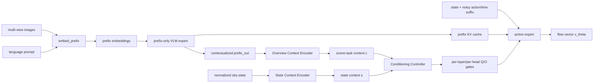

# OverLoCK 与 π0 融合修订版 V1：Contextualized Overview-Conditioned Action Expert

## 1. 文档定位

本文只规划第一阶段可实现、可归因、可验证的 OCAE，不包含 context token 插入、attention bias、K/V 调制或 π0.5 适配。

方法名称保持：

```text
Overview-Conditioned Action Expert (OCAE)
```

本修订版的关键变化是：

```text
旧版 V1：从 Gemma 输入前的 image/language embedding 生成 overview context
新版 V1：从 prefix-only Gemma 输出的 contextualized prefix hidden states 生成 overview context
```

新版方法一句话概括：

```text
先让冻结的 VLM prefix 完成视觉—语言联合编码，再从 contextualized prefix 中提取场景—任务先验，
结合机器人状态生成逐层逐 head 的条件 gate，以低秩方式调制 action expert 的 Q/O，
同时保持 prefix K/V、VLM expert 和原始 action expert 权重不变。
```

## 2. V1 范围

### 2.1 本版支持

```text
框架：JAX / Flax NNX + Linen bridge
模型：Pi0Config(pi05=False)
主干：PaliGemma VLM expert + Gemma action expert
上下文来源：contextualized prefix_out
调制对象：action expert Q 和/或 O
训练对象：OCAE 新增参数
主损失：原始 flow matching loss
```

### 2.2 本版不支持

```text
Pi0.5
PyTorch 训练和推理
context token 插入
prefix K/V 修改
suffix K/V 调制
attention logits bias
SigLIP 或 VLM expert 微调
完整 QKV hypernetwork
依赖 noisy action 或 timestep 的 overview context
辅助监督损失
```

选择只支持 π0 的原因：

1. π0 的连续 state 位于 action expert suffix，额外的 `StateContext` 是对已有状态信息的条件化重用。
2. π0.5 默认已把 state 离散化写入语言 prompt，再加入连续 `StateContext` 会形成重复状态路径。
3. 先在 π0 上验证 OCAE 是否有效，可以避免把收益与 π0.5 的输入语义变化混在一起。

## 3. 当前仓库中的关键事实

### 3.1 Prefix 与 suffix

`Pi0.embed_prefix()` 当前构造：

```text
SigLIP image tokens by view
+ PaliGemma language embeddings
```

这些 token 还没有经过 Gemma 的视觉—语言联合 self-attention。

`Pi0.embed_suffix()` 在 π0 中构造：

```text
continuous state token
+ noisy action/time tokens
```

### 3.2 训练与推理路径不一致

当前训练：

```text
[prefix, suffix] -> one joint Gemma forward
```

当前推理：

```text
prefix -> prefix-only Gemma forward -> KV cache
suffix -> Gemma forward with cached prefix K/V
```

由于 attention mask 禁止 prefix 读取 suffix，prefix hidden states 与 prefix K/V 不依赖 suffix。因而训练可以改成：

```text
prefix-only forward
suffix-only forward with KV cache
```

在 OCAE gate 为零时，这一拆分应与当前联合前向等价。

### 3.3 Action expert 的 Q/O 是稳定入口

当前 `gemma.Attention`：

1. 分 expert 生成 Q/K/V。
2. 在 token 轴拼接各 expert 的 Q/K/V。
3. 推理时把 prefix cache K/V 与当前 suffix K/V 拼接。
4. attention 输出再按 token 范围送入各 expert 独立的 O projection。

因此 V1 可以只在 expert index 1 上增加 conditional Q/O low-rank branch，而不修改：

```text
expert 0 Q/K/V/O
cached prefix K/V
expert 1 base Q/K/V/O
attention mask
RoPE positions
flow head
```

## 4. 修订版总体架构



核心计算：

```text
H_prefix, KV_prefix = VLM(prefix_embeddings)
c = OverviewContextEncoder(H_prefix, prefix_layout, prefix_masks)
s = StateContextEncoder(obs.state)
g_q, g_o = Controller(c, s)
v_theta = ActionExpert(suffix, KV_prefix, g_q, g_o)
```

其中：

```text
g_q: [B, L, N]
g_o: [B, L, N]
```

`L` 是 action expert 层数，`N` 是 query head 数。

## 5. 为什么使用 contextualized prefix

旧版 mean pooling 直接作用于 Gemma 输入前 token，存在以下问题：

1. language token 只是词表 embedding，mean pooling 丢失词序。
2. image 和 language 尚未完成跨模态交互。
3. 无法可靠表示物体间关系和指令角色，例如：

```text
put the cup into the bowl
put the bowl over the cup
```

新版使用 prefix-only Gemma 的最终 hidden states：

```text
H_prefix = [H_view_1, H_view_2, ..., H_language]
```

因为 prefix 内是 full attention，所以每个有效 prefix hidden state 已包含：

```text
视觉内容
语言指令
多视角信息
视觉—语言关系
```

这使 `c` 更符合“scene-task context”，而不是 image mean 与词袋 embedding 的简单拼接。

## 6. Prefix 表示与 layout

### 6.1 返回结构

建议把 `embed_prefix()` 返回值从 tuple 改为可被 JAX 识别的结构体：

```python
@flax.struct.dataclass
class PrefixEmbeddings:
    tokens: Array          # [B, P, D_vlm]
    input_mask: Array      # [B, P]
    ar_mask: Array         # [P]
    image_lengths: tuple[int, ...] = flax.struct.field(pytree_node=False)
    language_length: int = flax.struct.field(pytree_node=False)
```

`image_lengths` 和 `language_length` 是静态 layout 信息，用于在 `prefix_out` 上恢复各视角和语言片段。

不要通过 token 内容猜测边界，也不要把 padding token 当作有效语言上下文。

### 6.2 多视角汇聚

对每个视角单独汇聚：

```text
v_i = masked_mean(H_view_i, image_mask_i)
l   = masked_mean(H_language, language_mask)
```

然后：

```text
c = OverviewMLP([
    LayerNorm(v_1),
    LayerNorm(v_2),
    ...,
    LayerNorm(v_M),
    LayerNorm(l),
    view_validity_bits,
])
```

要求：

1. 保持仓库中的稳定 camera/view 顺序。
2. 不直接平均不同视角，避免丢失 base camera 与 wrist camera 的身份。
3. 缺失视角的 pooled vector 置零，并把 validity bit 一并输入。
4. masked mean 的分母至少为 1，避免无效视角产生 NaN。

### 6.3 Overview Context Encoder

V1 使用简单 MLP，不引入额外 cross-attention：

```text
overview_input
-> Dense(action_expert_width)
-> SiLU
-> Dense(action_expert_width)
-> c
```

输出：

```text
c: [B, D_action]
```

这里 `D_action` 必须从 action expert config 的 `width` 派生，不写死为 1024。

## 7. State Context Encoder

输入使用模型实际收到的 normalized、padded `obs.state`：

```text
obs.state: [B, action_dim]
```

编码器：

```text
obs.state
-> Dense(D_action)
-> SiLU
-> Dense(D_action)
-> s
```

输出：

```text
s: [B, D_action]
```

State Context 不进入 Overview Context Encoder。两路信息只在 controller 中融合：

```text
c：场景与任务先验
s：当前机器人状态
```

## 8. Conditioning Controller

### 8.1 输出

```text
h = MLP([LayerNorm(c), LayerNorm(s)])
raw_gate = Dense_zero_init(h)
raw_gate: [B, L * 2 * N]
```

reshape：

```text
raw_gate -> [B, L, 2, N]
g_q = tanh(raw_gate[:, :, 0, :])
g_o = tanh(raw_gate[:, :, 1, :])
```

最终：

```text
g_q, g_o: [B, L, N]
```

选择逐层逐 head gate 的原因：

1. action expert 各层承担的读取和变换功能不同。
2. controller 最终输出维度仅为 `2 * 18 * 8 = 288`，成本很低。
3. `nn.scan` 可以沿 layer 轴把对应 gate 传给每一层。

### 8.2 Identity-safe 初始化

Identity 由 controller 最后一层零初始化保证：

```text
raw_gate = 0
g_q = 0
g_o = 0
```

Conditional LoRA 的 A/B 使用小的非零随机初始化。

不要同时使用：

```text
zero gate
zero LoRA B
zero trainable alpha
```

否则可能导致条件分支首步完全没有有效梯度。

本版不使用 `init_alpha=0`。LoRA 保留固定缩放：

```text
lora_scale = lora_alpha / rank
```

默认可取：

```text
rank = 16
lora_alpha = 16
```

此时 identity 只由 gate=0 保证，初始化语义更清晰。

## 9. Conditional Q LoRA

action expert 的 Q weight 形状为：

```text
W_q: [N, D_action, H]
```

为每层 action expert 增加：

```text
A_q: [N, D_action, R]
B_q: [N, R, H]
```

计算：

```text
Q_base = einsum(x, W_q)                         # [B, T, N, H]
Q_low  = einsum(x, A_q)                         # [B, T, N, R]
Q_low  = Q_low * g_q[:, None, :, None]
Q_delta = einsum(Q_low, B_q)                    # [B, T, N, H]
Q = Q_base + lora_scale * Q_delta
```

然后再执行现有 RoPE 与 head-dim scaling。

要求：

1. 只在 expert index 1 上创建和应用。
2. 不修改 action expert K/V。
3. 不修改 expert 0 的任何分支。
4. gate 必须在 head 维仍然存在时应用。

## 10. Conditional O LoRA

attention encoded 表示：

```text
encoded: [B, T, N, H]
```

为每层 action expert 增加：

```text
A_o: [N, H, R]
B_o: [N, R, D_action]
```

计算：

```text
O_base = einsum(encoded, W_o)                   # [B, T, D_action]
O_low  = einsum(encoded, A_o)                   # [B, T, N, R]
O_low  = O_low * g_o[:, None, :, None]
O_delta = einsum(O_low, B_o)                    # [B, T, D_action], sum over N
O = O_base + lora_scale * O_delta
```

不能先把所有 head 汇总成 `[B, T, D_action]` 再施加 per-head gate，否则已经失去 head 维。

## 11. 对 π0 state token 的处理

π0 的 expert 1 suffix 包含：

```text
[state token, action token_1, ..., action token_H]
```

V1 调制整个 expert 1 suffix，而不是只调制最后的 action positions。

原因：

1. state token 本来就是 action expert 内部表示的一部分。
2. action token 会通过 attention 读取 state token。
3. 只调 action positions 需要额外 token-type mask，增加实现和归因复杂度。

论文和文档中应使用：

```text
condition the action expert suffix
```

而不是声称“只调制 action tokens”。

如果后续实验发现 state token 调制形成 shortcut，再增加 action-only mask 作为消融，不进入首版主实现。

## 12. 训练前向重构

### 12.1 Prefix pass

```python
prefix = self.embed_prefix(observation)
prefix_attn_mask = make_attn_mask(prefix.input_mask, prefix.ar_mask)
prefix_positions = cumsum(prefix.input_mask) - 1

(prefix_out, _), kv_cache = self.PaliGemma.llm(
    [prefix.tokens, None],
    mask=prefix_attn_mask,
    positions=prefix_positions,
    action_conditioning=None,
)
```

### 12.2 Context pass

```python
c = self.overview_action_conditioning.encode_overview(
    prefix_out,
    prefix,
    observation.image_masks,
    observation.tokenized_prompt_mask,
)
s = self.overview_action_conditioning.encode_state(observation.state)
q_gates, o_gates = self.overview_action_conditioning.make_gates(c, s)
```

### 12.3 Suffix pass

沿用当前 `sample_actions()` 中的 suffix mask、prefix cross mask 和 positions 逻辑：

```python
(_, suffix_out), _ = self.PaliGemma.llm(
    [None, suffix_tokens],
    mask=full_attn_mask,
    positions=suffix_positions,
    kv_cache=kv_cache,
    adarms_cond=[None, None],
    action_conditioning=(q_gates, o_gates),
)
```

输出与当前一致：

```text
v_t = action_out_proj(suffix_out[:, -action_horizon:])
loss = mean((v_t - u_t)^2, axis=-1)
```

### 12.4 为什么不增加额外 VLM 计算

联合前向与拆分前向都只计算一次 prefix token 和一次 suffix token 的 18 层表示。

拆分带来的主要变化是：

```text
执行顺序从 layer-wise joint 变成 prefix-complete -> suffix-with-cache
```

attention 的有效依赖关系不变。推理路径本来就是拆分形式。

## 13. 推理前向

推理时 overview context 只能计算一次，必须位于 denoising loop 外：

```text
1. preprocess observation
2. embed prefix
3. prefix-only Gemma -> prefix_out + KV cache
4. prefix_out -> c
5. state -> s
6. controller -> q_gates/o_gates
7. denoising loop:
       embed suffix(x_t, t)
       action expert with fixed KV cache and fixed q_gates/o_gates
       Euler update
```

V1 明确规定：

```text
c 不依赖 noisy action
c 不依赖 timestep
g_q/g_o 不在 flow step 间变化
Overview-Net 不在 denoising loop 内重算
```

## 14. `nn.scan` 与 Linen 初始化

### 14.1 Scan 输入

controller 输出先转置：

```text
g_q: [B, L, N] -> [L, B, N]
g_o: [B, L, N] -> [L, B, N]
```

在 `nn.scan` 中：

```text
q_gate in_axes = 0
o_gate in_axes = 0
positions/mask/adarms_cond/deterministic = broadcast
```

每个 `Block` 收到：

```text
q_gate_layer: [B, N]
o_gate_layer: [B, N]
```

如果 `action_conditioning is None`，`gemma.Module.__call__()` 应创建对应形状的零 gate，避免 prefix-only pass 与 disabled 模式出现不同调用结构。

### 14.2 Remat 参数位置

给 `Block.__call__()` 增加 conditioning 参数后，必须同步检查：

```text
nn.remat static_argnums
nn.scan in_axes
Block 调用参数顺序
Module.init dummy 调用
```

### 14.3 Lazy init

当前 `Pi0.__init__()` 通过 Linen bridge 的 `lazy_init(..., method="init")` 初始化 Gemma。

启用 OCAE 时，dummy init 必须让 expert 1 走过 conditional Q/O 参数创建路径，并传入零 gate。参数创建条件只能依赖静态 config：

```text
if ocae_config.enabled and expert_index == 1
```

不能依赖运行时 gate 是否为 None，否则 init 与 apply 的参数树可能不一致。

## 15. 配置设计

在 `overview_action_conditioning.py` 中定义配置，避免 `gemma.py` 与 `pi0_config.py` 之间产生循环依赖：

```python
@dataclasses.dataclass(frozen=True)
class OverviewActionConditioningConfig:
    enabled: bool = False
    rank: int = 16
    lora_alpha: float = 16.0
    target: Literal["q", "o", "q_o"] = "q_o"
    use_state_context: bool = True
```

在 `Pi0Config` 中增加：

```python
overview_action_conditioning: OverviewActionConditioningConfig = dataclasses.field(
    default_factory=OverviewActionConditioningConfig
)
```

`pi0.py` 创建 Gemma 时把该配置显式传入：

```python
_gemma.Module(
    configs=[paligemma_config, action_expert_config],
    embed_dtype=config.dtype,
    adarms=config.pi05,
    action_conditioning_config=config.overview_action_conditioning,
)
```

`gemma.Module/Block/Attention` 只读取该配置中的静态字段，用它决定是否创建 conditional Q/O 参数以及 rank/target，不在运行时根据 gate 是否为 None 决定参数树。

不在 V1 配置中加入：

```text
context_dim：从 action expert width 派生
num_context_tokens：V1 不插 context token
init_alpha：identity 改由 zero gate 保证
per_layer：V1 固定为 per-layer gate
context_source：V1 固定为 contextualized prefix
```

配置校验：

1. `rank > 0`。
2. `lora_alpha > 0`。
3. `target` 必须为 q/o/q_o。
4. V1 启用时 `pi05` 必须为 false。
5. V1 主实验不与任一 `*_lora` Gemma variant 同时使用。

第 5 条可以先发出明确错误，避免普通 LoRA 与 conditional LoRA 同时存在造成参数、checkpoint 和归因混乱。E0 使用独立的标准 LoRA 配置，不受该限制。

## 16. 代码改动范围

### 16.1 新增文件

```text
src/openpi/models/overview_action_conditioning.py
src/openpi/models/overview_action_conditioning_test.py
```

建议模块：

```text
PrefixLayout / PrefixEmbeddings
OverviewContextEncoder
StateContextEncoder
ActionConditioningController
OverviewActionConditioning
```

Conditional Q/O LoRA 参数应放在对应 scanned Gemma Attention layer 内，而不是放在外部 controller 文件中。

### 16.2 修改文件

```text
src/openpi/models/pi0_config.py
src/openpi/models/pi0.py
src/openpi/models/gemma.py
src/openpi/training/weight_loaders.py
src/openpi/models/pi0_test.py
src/openpi/models/model_test.py
src/openpi/training/config.py
```

修改原则：

1. OCAE disabled 时保留现有调用行为和 checkpoint 结构。
2. 不修改 SigLIP。
3. 不修改现有 LoRA 实现语义。
4. Conditional Q/O 使用独立参数名，避免和普通 LoRA 混淆。
5. 不改 Pi0FAST。

## 17. 参数命名

建议所有新增参数名包含稳定标识：

```text
overview_action_conditioning/...
conditional_q_lora_1/...
conditional_o_lora_1/...
```

其中 `_1` 表示 expert 1，与当前 Gemma expert 命名方式保持一致。

命名目标：

1. checkpoint loader 能精确允许缺失新参数。
2. freeze filter 能精确选择 OCAE 参数。
3. 日志和参数量统计能区分普通 LoRA 与 conditional LoRA。

## 18. Checkpoint loader

当前 `CheckpointWeightLoader` 只允许 checkpoint 缺失 `.*lora.*`。

修改为只允许以下新增参数缺失：

```text
.*(lora|overview_action_conditioning|conditional_q_lora|conditional_o_lora).*
```

由于 `conditional_*_lora` 已包含 `lora`，实现时可以进一步收敛正则，但测试必须覆盖所有实际参数路径。

禁止使用无条件 `.*`。

需要新增 loader 测试：

1. base checkpoint 能加载到 OCAE 模型。
2. OCAE 新参数来自当前初始化树。
3. 任一非 OCAE 参数缺失时仍然报错。
4. checkpoint 中多余、不匹配的参数不会掩盖必要参数缺失。

## 19. Freeze filter

V1 阶段 1 的可训练参数只能是：

```text
overview_action_conditioning/...
conditional_q_lora_1/...
conditional_o_lora_1/...
```

冻结：

```text
SigLIP
VLM Gemma expert
action expert base Q/K/V/O
action expert FFN 和 norm
state_proj
action/time input projections
action_out_proj
```

建议先构造 trainable regex：

```text
.*(overview_action_conditioning|conditional_q_lora_1|conditional_o_lora_1).*
```

再令：

```text
freeze_filter = Not(trainable_regex)
```

必须增加参数树测试，验证：

1. 所有 OCAE 参数均可训练。
2. 所有非 OCAE 参数均冻结。
3. `target="q"` 时没有 O branch 参数。
4. `target="o"` 时没有 Q branch 参数。

## 20. Identity 与梯度测试

### 20.1 拆分前向等价

在 OCAE disabled 下，对同一参数、输入、noise 和 timestep 比较：

```text
当前 joint prefix+suffix forward
修订版 prefix-cache + suffix forward
```

要求：

```text
float32 dummy model: exact equality 或 max_abs_diff = 0
bfloat16 real config: 在明确的数值容差内 allclose
```

### 20.2 Zero-gate identity

对同一个 augmented model 比较：

```text
conditional branch bypass
conditional branch enabled with q_gate=o_gate=0
```

要求：

```text
suffix hidden states 相等
flow output相等
sample_actions 在固定 noise 下相等
prefix KV cache 完全相等
```

### 20.3 梯度可训练性

zero gate 初始化下第一次 backward：

```text
controller zero-init final projection gradient != 0
loss finite
所有梯度无 NaN/Inf
```

执行一次 optimizer update 后再次 backward：

```text
conditional Q/O A/B 至少有一组 gradient norm > 0
overview encoder 和 state encoder gradient norm > 0
```

该测试用于防止“identity 成立但模块永远学不动”。

## 21. 功能测试

必须覆盖：

1. dummy π0 `compute_loss()` shape 正确。
2. dummy π0 `sample_actions()` shape 正确。
3. JIT 下启用和禁用 OCAE 都能编译。
4. `target=q/o/q_o` 均能运行。
5. 缺失视角 mask 不产生 NaN。
6. language padding 不影响 masked pooled context。
7. 同图不同语言得到不同 gate。
8. 同图同语言不同 state 得到不同 gate。
9. prefix cache 不随 language/state conditioning controller 的开关而改变。
10. Overview Context Encoder 在 denoising loop 外只执行一次。

第 7、8 项只要求随机初始化后形状与计算路径有效；真正语义差异由训练后诊断判断。

## 22. 训练策略

### 22.1 阶段 0：工程验收

不开始正式训练，先完成：

```text
checkpoint load
freeze 参数统计
joint/split equivalence
zero-gate identity
gradient flow
JIT compute_loss
JIT sample_actions
```

任何一项失败都不进入正式实验。

### 22.2 阶段 1：OCAE-only

初始化：

```text
base π0 checkpoint
+ 随机初始化 OCAE A/B
+ zero-init controller output gate
```

只训练 OCAE 参数。

优化建议起点：

```text
optimizer: AdamW
peak LR: 1e-4 到 3e-4，先做小范围 sweep
weight decay: 与现有 LoRA finetune 保持一致
gradient clipping: 沿用现有训练配置
EMA: 沿用 JAX trainer 默认设置
```

首轮不要增加 auxiliary loss。

### 22.3 阶段 2

不属于 V1 实现验收。只有 OCAE-only 明确优于 matched baseline 后才考虑：

```text
解冻 action_out_proj
解冻 action expert 后若干层的普通 LoRA
加入 overview queries
```

## 23. 实验矩阵

### 23.1 工程基线

| 编号 | 设置 | 目的 |
|---|---|---|
| T0 | 原始 joint forward | 当前行为参考 |
| T1 | split prefix/cache forward, OCAE disabled | 验证前向重构 |
| T2 | OCAE enabled, zero gate | 验证 identity |

T0/T1/T2 是测试，不应作为独立训练实验占用 rollout 预算。

### 23.2 性能与归因实验

| 编号 | 设置 | 目的 |
|---|---|---|
| E0 | 原始 π0 action-expert LoRA | 仓库常用微调基线 |
| E1 | Static Q/O LoRA | 相同 Q/O 位置、相同 rank，无样本条件 |
| E2 | Constant-input OCAE | 保留完整参数树，但所有样本使用同一组固定非零 prefix/state reference input |
| E3 | action-suffix gated adapter | 对比普通 action adapter |
| E4 | image-token gate | 对比常规视觉 gating |
| E5 | OCAE Q-only | 验证 conditional query |
| E6 | OCAE O-only | 验证 conditional output |
| E7 | OCAE Q/O | 主方法 |
| E8 | OCAE Q/O, no visual context | 验证视觉贡献 |
| E9 | OCAE Q/O, no language context | 验证语言贡献 |
| E10 | OCAE Q/O, no state context | 验证状态贡献 |
| E11 | OCAE Q/O, shuffled language | 验证语言语义对齐 |
| E12 | OCAE Q/O, shuffled state | 验证状态对齐 |
| E13 | OCAE Q/O, shuffled images/views | 验证视觉对齐 |

其中最关键的 matched baseline 是 E1 和 E2：

```text
E7 > E1：收益不只是 Q/O LoRA 的额外容量
E7 > E2：收益来自 sample-conditioned context，而不是 controller 参数量
```

E2 必须让固定的非零 reference input 继续经过与 E7 相同的 overview encoder、state encoder 和 controller，使这些参数仍参与反向传播；不能直接绕过 encoder 后塞入常量 `c/s`，否则只是名义参数量相同。

### 23.3 公平性要求

所有核心比较必须报告：

```text
训练数据量
训练 step
batch size
优化器与 LR
随机种子
可训练参数量
总参数量
训练吞吐
推理延迟
峰值显存
```

至少运行 3 个 seed；rollout success 是主指标，validation flow loss 只作为辅助指标。

## 24. 任务选择

主任务应要求语言角色、全局场景与局部动作共同决定行为：

1. 按指定按钮、开关或把手。
2. 从多个相似物体中选择语言指定目标。
3. 把物体放入指定容器，尤其是狭窄容器。
4. 多物体桌面整理。
5. 折叠、打包、装配等多阶段任务。

简单 pick-and-place 可以作为 sanity check，但不能单独支撑方法结论。

## 25. 诊断指标

除成功率外，必须记录：

1. `g_q/g_o` 每层每 head 的均值、方差和绝对值分布。
2. 同一观测、不同语言下的 gate 距离。
3. 同一图像语言、不同 state 下的 gate 距离。
4. shuffled input 前后的 gate 与成功率变化。
5. Q/O delta 相对 base Q/O 的 norm ratio。
6. action expert 对 prefix token 的 attention 分布变化。
7. 不同 camera view 获得的 attention mass。
8. rollout success 与 validation loss 的相关性。

建议重点监控：

```text
||Q_delta|| / ||Q_base||
||O_delta|| / ||O_base||
```

如果比例长期接近 0，说明 OCAE 没有真正参与；如果过大，可能破坏 base expert 表示。

## 26. 主要风险与对应处理

### 26.1 Context 退化成语言表示

现象：

```text
no-visual 与完整模型性能接近
shuffled images 对 gate 和 rollout 影响很小
```

处理：

1. 先确认 contextualized prefix view slicing 与 mask 正确。
2. 检查各视角 pooled feature norm。
3. 只有确认 mean pooling 不足后，才升级为少量 overview queries。

### 26.2 State shortcut

现象：

```text
no-language/no-visual 仍接近完整模型
gate 几乎只随 state 变化
```

处理：

1. state encoder 降维或减小容量。
2. 对 state context 使用 dropout。
3. 保留 no-state 与 shuffled-state 对照。

首版不提前加入正则，先通过消融判断问题是否真实存在。

### 26.3 Gate 近似常数

现象：

```text
不同任务和 observation 的 gate 距离很小
E7 与 E2 接近
```

说明 conditional controller 没有形成样本相关调制。此时不应继续 V2/V3。

### 26.4 只改善 loss，不改善 rollout

说明模块可能只提升离线拟合。结论必须以闭环成功率为准。

### 26.5 Scan / remat 参数错误

典型表现：

```text
参数树缺少 conditional LoRA
不同调用模式参数树不一致
JIT tracing 报 in_axes 或 static_argnums 错误
```

处理顺序：

1. dummy Linen Module init/apply。
2. dummy NNX bridge create。
3. compute_loss eager。
4. compute_loss JIT。
5. sample_actions JIT。

## 27. 实现顺序

### Step 1：前向拆分

修改 `compute_loss()` 使用 prefix-only cache + suffix-only forward。

验收：

```text
OCAE disabled 时 joint/split 等价
现有模型测试通过
```

### Step 2：Prefix layout 与 contextual pooling

增加 `PrefixEmbeddings/PrefixLayout` 和 Overview Context Encoder。

验收：

```text
多视角和语言 slice 正确
mask/padding/缺失视角测试通过
c shape 正确且 finite
```

### Step 3：State encoder 与 controller

生成 `[B,L,N]` zero-init Q/O gates。

验收：

```text
初始 gate 全零
controller final projection 有非零梯度
```

### Step 4：Conditional Q LoRA

先只实现 Q branch。

验收：

```text
zero gate identity
非零 gate 改变 action expert 输出
prefix KV 不变
```

### Step 5：Conditional O LoRA

增加 O branch，确认 gate 在 head 汇总前应用。

验收同 Step 4。

### Step 6：Checkpoint 与 freeze

验收：

```text
base π0 checkpoint 可加载
只有 OCAE 参数可训练
参数量统计可复现
```

### Step 7：端到端 smoke training

在小数据和少量 step 上确认：

```text
loss finite
gate 从零开始变化
Q/O delta norm 非零
训练吞吐和显存可接受
checkpoint 可保存和恢复
```

### Step 8：正式实验

先跑：

```text
E0, E1, E2, E5, E6, E7
```

只有 E7 显示正向趋势后再跑完整消融。

## 28. Go / No-Go 标准

### 工程 Go

必须全部满足：

```text
joint/split baseline 等价
zero-gate identity 成立
prefix KV 完全不受 OCAE 影响
新增参数能从 base checkpoint 正确初始化
freeze 参数树正确
梯度能从 loss 到 controller、overview/state encoder 和 Q/O LoRA
JIT train/inference 均通过
```

### 研究 Go

最低要求：

```text
E7 > E1
E7 > E2
若论文主张优于普通 visual/action gating，则 E7 > E3 且 E7 > E4
no/shuffled visual-language-state 消融符合预期
rollout success 有稳定提升，而非只有 validation loss 改善
推理延迟和显存增加在可接受范围内
```

### No-Go

出现以下情况时不继续 context token 或 attention bias 版本：

```text
E7 与 E2 接近：conditioning 基本是常数
E7 不优于 E1：收益只是低秩容量
visual ablation 无影响：overview 没有使用视觉
rollout 无收益：离线 loss 改善不能转化为控制性能
额外延迟或显存不符合部署要求
```

## 29. 方法表述边界

推荐表述：

```text
We propose an Overview-Conditioned Action Expert for flow-matching vision-language-action models.
OCAE first extracts a compact scene-task prior from contextualized visual-language prefix states,
and combines it with robot state to produce layer- and head-specific gates for conditional low-rank
query and output adaptation in the action expert. The pretrained VLM expert and cached prefix keys
and values remain unchanged, allowing the action expert to conditionally read and decode a fixed
visual-language memory without altering the cache.
```

中文：

```text
我们提出 Overview-Conditioned Action Expert。该方法先从完成视觉—语言联合编码的 prefix hidden states
中提取紧凑的场景—任务先验，再结合机器人状态生成逐层逐 head 的条件 gate。OCAE 不修改预训练 VLM
expert 和 cached prefix K/V，而是通过条件低秩 Q/O 分支校准 action expert 对固定视觉—语言记忆的读取
与写回方式。
```

不要声称：

```text
OCAE 动态生成完整 QKV 权重
OCAE 直接学习目标区域 heatmap
OCAE 完全复现 OverLoCK 的局部—全局模块
OCAE 只调制 action token（V1 实际调制整个 expert 1 suffix）
```

更准确的研究关系是：

```text
OCAE 将 OverLoCK 的 overview-first、context-conditioned local processing 原则，
迁移到 flow-matching VLA 中 action expert 读取 contextualized prefix memory 的过程。
```

## 30. 最终推荐路线

```text
V1-A：工程正确性
    split prefix/cache training
    contextualized prefix pooling
    zero-gate controller
    Q-only conditional LoRA

V1-B：完整主方法
    Q/O conditional LoRA
    per-layer/per-head gate
    OCAE-only training
    matched static/constant-context baselines

仅在 V1-B 成立后考虑：

V2：learnable overview queries 或 context token
V3：action-to-prefix attention bias
V4：suffix-only K/V modulation
```

本版的核心判断标准不是“模块能否接入”，而是：

```text
在 prefix cache 完全不变的前提下，sample-conditioned Q/O modulation 是否比相同位置、相同 rank 的
静态低秩适配更有效，并且这种收益能否通过视觉、语言和状态消融得到明确归因。
```
